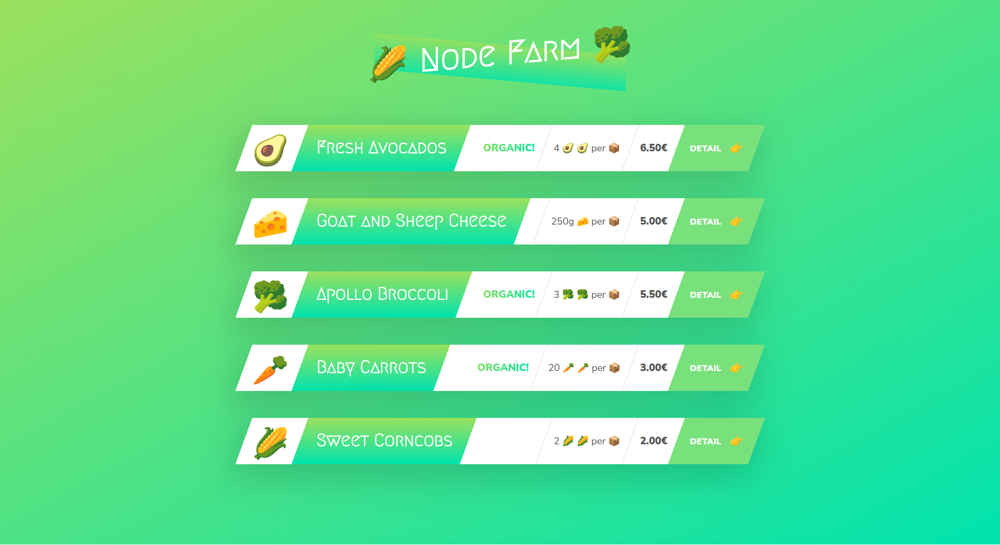
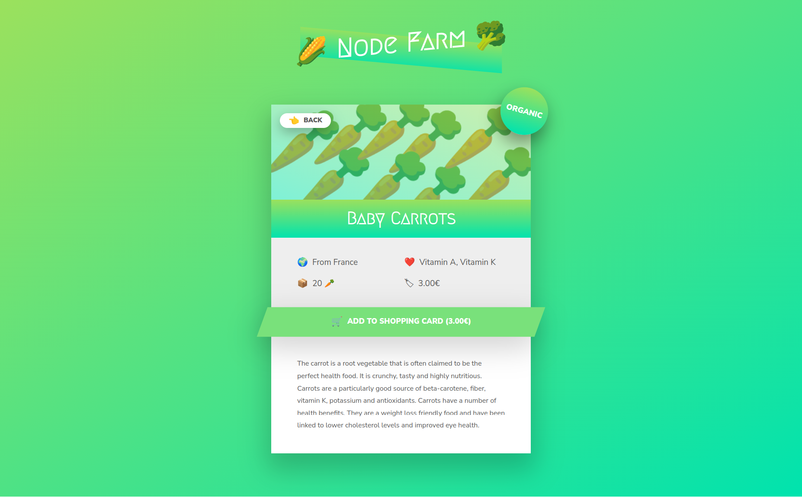

# Node Farm Project using Plain Node.js

  
   

I developed this project as my first step into backend development using Node.js. The application was built exclusively with plain Node.js, without the use of any additional frameworks such as Express.js. Thanks to the wonderful instructor Jonas Schmedtmann, I was able to complete this project as part of my journey in this [course](https://www.udemy.com/course/nodejs-express-mongodb-bootcamp/).

## To Boot Up the Project

1. Clone the project to your local machine: `git clone git@github.com:polaeskandar/project-node-farm.git`.
2. Change into the project directory: `cd project-node-farm`.
3. Run the application: `node index.js`.

## Feedback & Contact

If you have any feedback you would like to give regarding this project, please feel free to open a new issue in the issues tab. Alternatively, you can reach me through the following:

- LinkedIn: [@polaeskandar](https://www.linkedin.com/in/polaeskandar/)
- Business Email: pola.eskandar@codingstreamer.com
